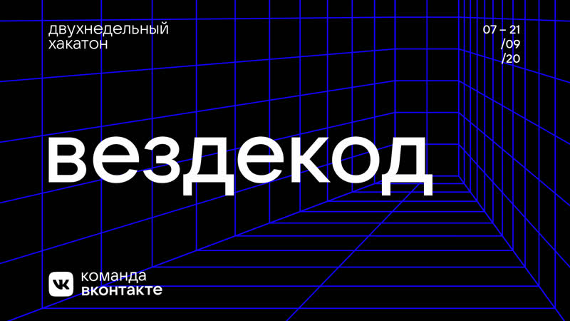

# Вездекод

    

 

«Вездекод» — двухнедельный марафон для разработчиков и дизайнеров от ВКонтакте, проходивший с 
7 сентября по 21 сентября 2020.

Каждый день публикуется основное задание по одному из треков (дизайн, веб и мобайл). Оно расчитано 
на 24 часа и максимальный балл, который можно за него получить, - 25.

Помимо основных заданий проводились дополнительные активности, как для ограниченного количества команд
(кто успел зарегистрироваться на активность), так и для всех команд (тесты). Максимальный балл за 
дополнительные активности - 10, либо 10 на каждого участника команды, отправивших решение (в завимиости
от типа активности).

## Задания

* Хотфикс. Дизайн ([задание](https://vk.com/@tech-task-hotfix-design), ~~решение~~)
    * +9 баллов
* Хотфикс. Мобайл ([задание](https://vk.com/@tech-task-hotfix-mobile), ~~решение~~)
* Хотфикс. Веб ([задание](https://vk.com/@tech-task-hotfix-web), [решение](hotfix.web))
    * +25 баллов
* Пожертвования. Дизайн ([задание](https://vk.com/@tech-task-donations-design), ~~решение~~)
* Пожертвования. Мобайл ([задание](https://vk.com/@tech-task-donations-mobile), ~~решение~~)
* Подкасты. Дизайн ([задание](https://vk.com/@tech-task-podcasts-design), [решение](https://www.figma.com/file/s5TFEQpzMMFVAaAOYz0dCm/vk-vesdecode-Podcast.Design))
    * +4 балла
* Пожертвования. Веб ([задание](https://vk.com/@tech-task-donations-web), [решение](donations.web))
    * +17 баллов
* Задание от VK Mini Apps ([задание](https://vk.com/@tech-task-vkminiapps), [решение](vk_mini_apps_task))
    * +17 баллов
* Карта эмоций. Дизайн ([задание](https://vk.com/@tech-task-discover-design), ~~решение~~)
* Подкасты. Мобайл ([задание](https://vk.com/@tech-task-podcast-mobile), ~~решение~~)
* Подкасты. Веб ([задание](https://vk.com/@tech-task-podcasts-web), [решение](podcasts.web))
    * +22 балла
* Карта эмоций. Мобайл + Веб ([задание](https://vk.com/@tech-emotions-map), ~~решение~~)
